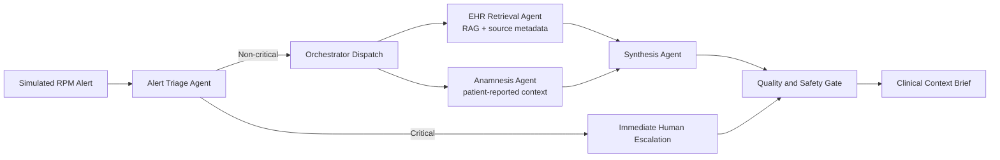

# ClinicalBridge

ClinicalBridge is an educational, LLM-powered multi-agent prototype that turns a simulated Remote Patient Monitoring alert into a concise, source-traceable Clinical Context Brief. It combines three deliberately fragmented data sources:

- longitudinal Electronic Health Record data;
- current Remote Patient Monitoring measurements and trends;
- patient-reported anamnesis, symptoms, adherence, and lifestyle context.

The system is a proof of concept for COP-3442 Prompt Engineering. It is **not a clinical tool**, does not make diagnoses, and must never be used with real patient records.

## Team

| Student | Student number |
|---|---:|
| Erkan Işık Bacak | 2200914 |
| Raymond Lasses | 2200274 |
| Ata Uzun | 2103247 |
| Kutlay Başar Aklan | 2202139 |

## What is included

- four specialized agents: Alert Triage, EHR Retrieval, Anamnesis, and Synthesis;
- a LangGraph orchestrator with parallel EHR/anamnesis processing;
- fail-safe bypass and immediate human escalation for critical alerts;
- OpenAI JSON-schema output and function calling through LangChain;
- OpenAI embeddings and persistent Chroma for the live RAG path;
- a deterministic local fallback for key-free tests and demonstrations;
- 12 entirely fictional patients and eight end-to-end scenarios;
- a CLI, Streamlit dashboard, and annotated demonstration notebook;
- versioned prompt library with three iterations per agent and three few-shot examples;
- evaluation harness, raw results, test suite, reports, and design documentation.

## Architecture



## Setup

ClinicalBridge requires Python 3.11 or newer.

```bash
python3 -m venv .venv
source .venv/bin/activate
python -m pip install -e ".[dev]"
```

The repository includes a local `.env` file (copy `.env.example`) with placeholders. Add the API key there. The full set of supported variables and their defaults is:

```dotenv
# Credentials and models
OPENAI_API_KEY=                              # required for live/auto-with-key runs
OPENAI_MODEL=gpt-5.4-mini                     # synthesis/reasoning model
OPENAI_EMBEDDING_MODEL=text-embedding-3-small # RAG embedding model

# Runtime behavior
CLINICALBRIDGE_MODE=auto                       # auto | offline | live
CLINICALBRIDGE_RAG_BACKEND=chroma              # chroma (live) | lexical fallback for tests
CLINICALBRIDGE_REASONING_EFFORT=low            # reasoning effort for bounded extraction/synthesis
CLINICALBRIDGE_RETRIEVAL_K=6                   # top-k EHR chunks retrieved per query
CLINICALBRIDGE_MAX_RETRIES=2                   # bounded provider retries
```

The `.env` file is ignored by Git. Do not paste or commit API keys.

| Variable | Default | Purpose |
|---|---|---|
| `OPENAI_API_KEY` | _(empty)_ | OpenAI key; required for `live` and for `auto` to use the API |
| `OPENAI_MODEL` | `gpt-5.4-mini` | Model for triage explanation, EHR/anamnesis, and synthesis |
| `OPENAI_EMBEDDING_MODEL` | `text-embedding-3-small` | Embedding model for the Chroma RAG path |
| `CLINICALBRIDGE_MODE` | `auto` | `auto` uses OpenAI when a key is present, else the deterministic fallback; `offline` forces no-cost reproducible runs; `live` requires the API |
| `CLINICALBRIDGE_RAG_BACKEND` | `chroma` | Persistent vector store for live retrieval; a lexical retriever backs the deterministic tests |
| `CLINICALBRIDGE_REASONING_EFFORT` | `low` | Reasoning effort; low suits the bounded extraction and synthesis tasks |
| `CLINICALBRIDGE_RETRIEVAL_K` | `6` | Number of patient-scoped EHR chunks retrieved per query |
| `CLINICALBRIDGE_MAX_RETRIES` | `2` | Bounded retries for transient provider errors |

## Run the prototype

Check the environment:

```bash
clinicalbridge doctor
```

List scenarios:

```bash
clinicalbridge scenarios
```

Run one scenario:

```bash
clinicalbridge run --scenario scenario_03
```

Return or save machine-readable output:

```bash
clinicalbridge run --scenario scenario_03 --json
clinicalbridge run --scenario scenario_03 --save output/scenario_03.md
```

Launch the recommended dashboard:

```bash
streamlit run app.py
```

## Evaluate and test

Run the deterministic end-to-end evaluation:

```bash
python evaluation/evaluate.py --mode offline --prompt-version v4
python evaluation/prompt_quality.py
```

Run all tests:

```bash
pytest
```

The completed live comparison is stored under `evaluation/results/`. To rerun the final live version:

```bash
python evaluation/evaluate.py --mode live --prompt-version v4
```

The live command makes OpenAI API and embedding calls and may incur cost.

The measured live prompt-version results were:

| Version | Scenario pass rate | Triage accuracy | Key-concern coverage | Mean latency |
|---|---:|---:|---:|---:|
| v1 | 87.5% | 87.5% | 77.15% | 14.17s |
| v2 | 62.5% | 62.5% | 72.71% | 15.31s |
| v3 | 75.0% | 75.0% | 75.14% | 14.54s |
| v4 final | 100% | 100% | 95.21% | 20.21s |

All versions achieved 100% required-source recall, source traceability, and safety compliance with a 0% unsupported-source proxy after system guardrails. The final v4 configuration clears both capstone performance targets — mean key-concern coverage >= 85% and mean live latency < 30s — and was confirmed stable across three repeated live runs (coverage 92.2% / 98.3% / 95.2%, latency 18.7s / 17.8s / 20.2s). Coverage and latency were brought onto target through data-only changes (normalizing gold key-concern wording and trimming non-required EHR records); see `docs`/`evaluation_report.md` and `data_dictionary.md`.

## Repository guide

| Path | Purpose |
|---|---|
| `src/clinicalbridge/` | Agents, schemas, memory, retrieval, orchestration, rendering, and CLI |
| `app.py` | Streamlit dashboard |
| `data/simulated/` | EHR, RPM, anamnesis, alerts, scenarios, and manifest |
| `prompts/` | Prompt versions and few-shot examples for all four agents |
| `evaluation/` | Evaluation harness, prompt linter, and raw results |
| `tests/` | Unit, safety, retrieval, dataset, and workflow tests |
| `notebooks/` | Annotated end-to-end demonstration |
| `docs/` | Design, model selection, prompt portfolio, reports, and limitations |
| `scripts/` | Deterministic artifact-generation utilities |

## Safety principles

- Every dataset record is fictional and marked as simulated.
- Critical alerts bypass routine context synthesis.
- Every finding, risk consideration, and action must cite a supplied source ID.
- Missing and contradictory data are surfaced instead of silently resolved.
- Every output requires human review and includes a non-diagnostic disclaimer.
- The system proposes contextual review actions; it does not prescribe or diagnose.

## Current API choices

The default `gpt-5.4-mini` model was selected as the cost- and latency-conscious option for repeated multi-agent calls. The live workflow uses OpenAI JSON-schema output for three agents, function calling for the heterogeneous EHR schema, `text-embedding-3-small`, and the Responses API path exposed through `langchain-openai`. All model and embedding IDs remain configurable in `.env`.

## License

MIT for the software implementation. The capstone brief and course materials retain their original ownership.
