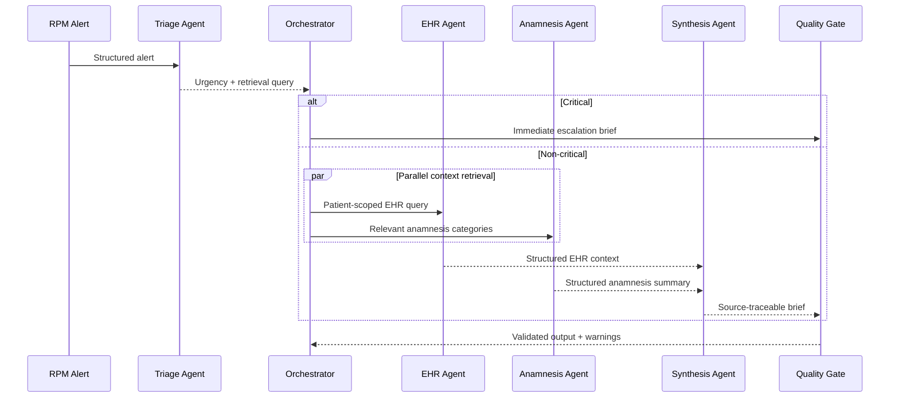

# ClinicalBridge Application Design

## Product objective

ClinicalBridge accepts a simulated RPM alert and produces a source-traceable Clinical Context Brief that can be reviewed in under 60 seconds. The prototype reduces the reader's need to manually search three disconnected sources while preserving uncertainty and clinician authority.

## Users

The simulated users are primary-care physicians and RPM nurses monitoring chronic conditions. Their core need is not more raw data; it is a short explanation of why an alert matters for this patient, what evidence supports that interpretation, what remains unknown, and what should be reviewed next.

## Input and output contracts

The entry contract is `RPMAlert`, which contains patient identity, timestamp, device type, alert category, measurements, units, patient-specific thresholds, baseline, trend, device metadata, and an immutable source ID.

The exit contract is `ClinicalContextBrief`, which contains:

1. alert summary and urgency;
2. patient snapshot;
3. contextual findings with source IDs;
4. non-diagnostic risk considerations with source IDs;
5. clinician-review actions with priority, confidence, and source IDs;
6. uncertainty and data gaps;
7. source inventory, confidence, mandatory human-review flag, and disclaimer.

Pydantic validates all inter-agent contracts. Triage, anamnesis, and synthesis use OpenAI native JSON-schema output through LangChain. The EHR agent uses OpenAI function calling because its heterogeneous dictionaries are not compatible with strict JSON Schema; its result is still validated against `EHRContext`.

## Components

### Alert Triage Agent

The triage agent validates alert metadata, classifies urgency, records concise decision factors, and formulates a structured retrieval query. A deterministic threshold tool acts as a safety backstop. If that tool identifies a critical threshold, an LLM cannot lower the classification.

### EHR Retrieval Agent

The live RAG path chunks each fictional EHR into source-level documents and stores OpenAI embeddings in persistent Chroma. Retrieval is filtered by patient ID. The agent converts retrieved chunks into a structured EHR context while preserving source IDs, contradictions, and missing categories.

The offline path uses patient-scoped TF-IDF retrieval. It exists for reproducibility, tests, demonstrations before a key is supplied, and safe fallback behavior. It is not presented as equivalent to semantic vector retrieval.

### Anamnesis Agent

The anamnesis agent extracts symptom timelines, reported adherence, lifestyle factors, family history, patient concerns, and relevant sensitive disclosures. It keeps reported behavior distinct from prescribed medication status and uses neutral language for conflicts.

### Synthesis Agent

The synthesis agent correlates the alert, triage result, EHR context, and anamnesis summary. It cannot add unsupported claims: every finding, risk, and action contains one or more source IDs. Its recommendations are actions for clinician review, not diagnoses or treatment orders.

### Orchestrator

The LangGraph orchestrator owns routing, parallelism, critical-alert bypass, session logging, and the final quality gate. It does not perform clinical reasoning.

## Workflow

## Error handling and fallback strategy

- OpenAI calls use bounded retries and a 60-second request timeout.
- Schema failures are surfaced by the model integration rather than accepted as malformed text.
- `auto` mode uses the live path only when an API key is present.
- `offline` mode provides deterministic behavior for testing and presentation continuity.
- Critical-alert routing does not depend on successful EHR or anamnesis retrieval.
- The quality gate restores mandatory human review and the standard disclaimer if either is absent.
- Unknown source references generate explicit warnings.

## Auditability and memory

Each run creates a session identifier and a JSON audit log. The log contains:

- conversation/event memory: each agent input-output event;
- summary memory: short workflow summaries used for audit and demonstration;
- entity memory: stable patient-level facts such as patient ID, urgency, and stated concerns.

No memory is shared across fictional patients. Generated session logs are excluded from Git because they are runtime artifacts.

## Nonfunctional requirements

- Python 3.11 or newer;
- one CLI entry point and one Streamlit entry point;
- reproducible offline tests;
- under 30 seconds for non-critical alerts in the capstone target environment;
- no real patient data;
- all key runtime settings controlled through `.env`;
- source-traceable claims and mandatory clinician review.
